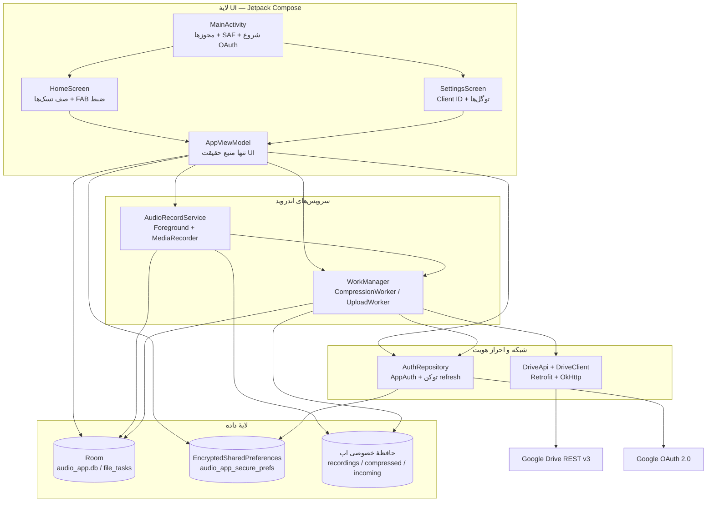
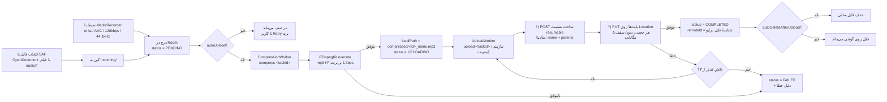
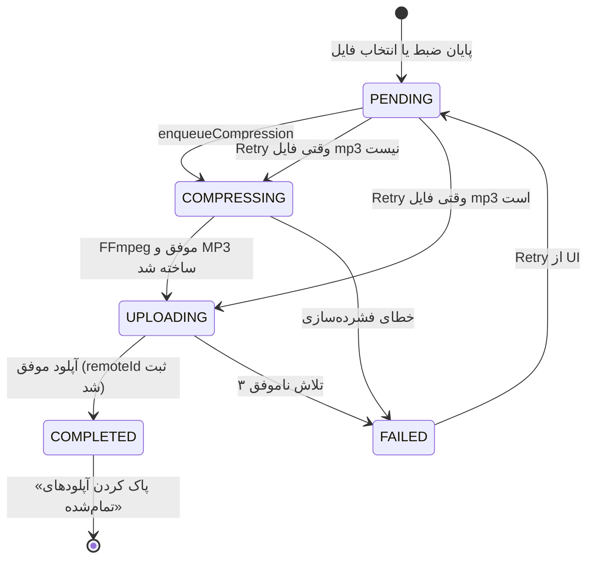
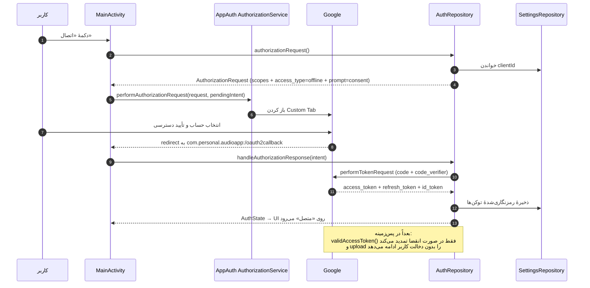
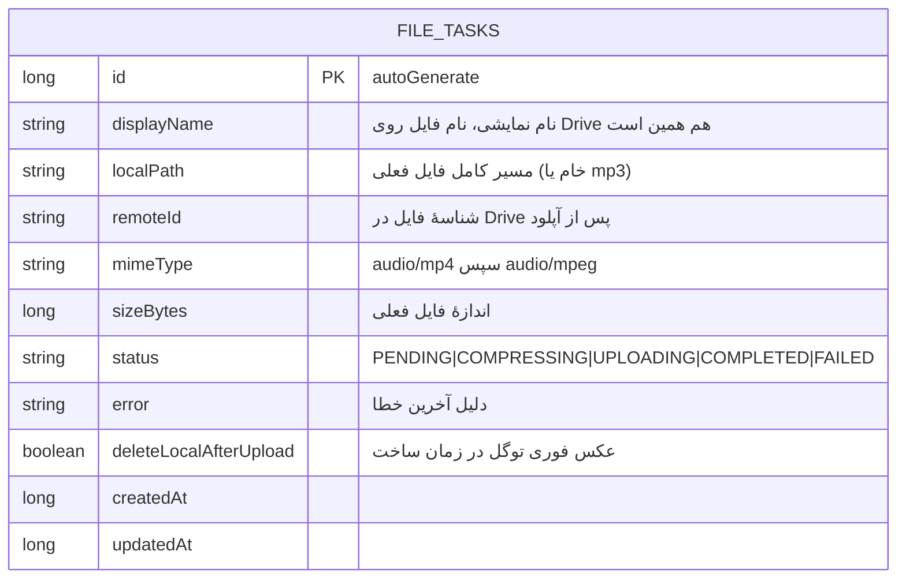
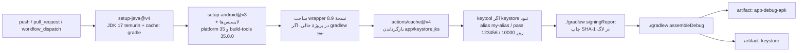

# نمودار و معماری پروژه — صدا به درایو

> این سند برای «ادامه دادن پروژه با کمک AI» نوشته شده است. نمودارهای زیر Mermaid هستند: روی GitHub و در VS Code (با افزونهٔ Markdown Preview Mermaid) رندر می‌شوند. کل متن را می‌توانید به‌عنوان context به هر AI دیگری بدهید.

---

## ۱. نمای کلی سیستم



**سه قاعده‌ای که معماری روی آن بنا شده:**

1. **هیچ سروری وجود ندارد** — احراز هویت با OAuth 2.0 (Authorization Code + PKCE) و توکن refresh روی خود دستگاه، و آپلود مستقیم از گوشی به `www.googleapis.com`.
2. **UI فقط وضعیت را می‌خواند** — `AppViewModel` تنها منبع حقیقت است (`StateFlow`)؛ صف از Room می‌آید و کارهای سنگین در WorkManager اجرا می‌شوند (پس با بستن اپ هم ادامه پیدا می‌کنند).
3. **حافظهٔ خصوصی اپ، نه حافظهٔ مشترک** — فایل‌ها در `Android/data/com.personal.audioapp/files/` کپی می‌شوند تا بدون مجوز ذخیره‌سازی قابل خواندن باشند و با حذف اپ پاک شوند.

---

## ۲. مسیر یک فایل صوتی (قلب پروژه)



دستور دقیق FFmpeg:

```
-y -hide_banner -i "<input>" -vn -map_metadata -1 -ac 2 -ar 44100 -c:a libmp3lame -b:a 64k -f mp3 "<output>"
```

نام کارهای WorkManager یکتا هستند (`compress-<taskId>` و `upload-<taskId>` با سیاست `REPLACE`)، پس زدن دکمهٔ «تلاش دوباره» نسخهٔ قبلی را جایگزین می‌کند و کار تکراری ساخته نمی‌شود.

---

## ۳. چرخهٔ حیات یک تسک



نکتهٔ مهم: `Retry` هوشمند است — اگر `localPath` به `.mp3` ختم شود فقط آپلود تکرار می‌شود و بایت‌های صوتی دوباره فشرده نمی‌شوند.

---

## ۴. جریان ورود به گوگل (OAuth)



دو نقطهٔ حساس که در ادامهٔ کار باید بدانید:

- **`prompt=consent` + `access_type=offline`** عمدی است تا گوگل `refresh_token` بدهد؛ بدون آن آپلود پس‌زمینه پس از بستن اپ کار نمی‌کند.
- **نوع OAuth client** روی این جریان اثر می‌گذارد: نوع `Android` به package name + SHA-1 گره می‌خورد و با هر keystore جدید عوض می‌شود؛ نوع `Desktop app` با ثبت redirect URI کار می‌کند و ممکن است `client_secret` بخواهد (که اپ فعلاً فیلدی برای آن ندارد).

---

## ۵. مدل داده



| محل ذخیره | کلید/نام | توضیح |
|---|---|---|
| `audio_app_secure_prefs` | `google_client_id` | Client ID گوگل |
| | `refresh_token` / `access_token` / `access_token_expiry` | توکن‌ها (رمزنگاری‌شده) |
| | `auth_state_json` | سریال‌شدهٔ `AuthState` (سازگاری با AppAuth) |
| | `account_email` | فقط برای نمایش |
| | `drive_folder_id` | پوشهٔ مقصد؛ اگر ۴۰۴ بگیرد خودش پاک می‌شود |
| | `auto_upload` / `auto_delete_after_upload` / `auto_delete_source_after_compression` | سه توگل تنظیمات |
| Room | `audio_app.db` → جدول `file_tasks` | صف تسک‌ها |
| حافظه | `files/recordings`, `files/compressed`, `files/incoming` | فایل‌های خام، MP3 نهایی، فایل واردشده |

---

## ۶. خط لولهٔ CI (تنها راه ساخت APK)



نکات کلیدی این خط لوله:

- wrapper **داخل پروژهٔ خالی** ساخته می‌شود تا به نسخهٔ Gradle نصب‌شده روی runner حساس نباشد؛ سپس `./gradlew` نسخهٔ 8.9 را دانلود می‌کند.
- keystore از کش Actions بازگردانده می‌شود تا **SHA-1 بین اجراها ثابت بماند** (یک بار مفقود شدن کش = امضای جدید).
- `signingConfigs` در `app/build.gradle.kts` فقط وقتی `app/keystore.jks` وجود داشته باشد فعال می‌شود؛ در غیر این صورت کلید debug خود AGP استفاده می‌شود.

---

## ۷. لایه‌ها و مسئولیت فایل‌ها

| لایه | فایل | مسئولیت |
|---|---|---|
| Entry | `AudioApp.kt` | کانال نوتیفیکیشن + راه‌اندازی اولیه |
| Entry | `ui/MainActivity.kt` | مجوزها، SAF، شروع/دریافت OAuth، میزبان Compose |
| UI | `ui/HomeScreen.kt` | کارت وضعیت درایو، دکمه‌ها، صف، چیپ وضعیت |
| UI | `ui/SettingsScreen.kt` | Client ID، پوشهٔ درایو، حساب، سه توگل |
| UI | `ui/AppViewModel.kt` | تمام اکشن‌ها + `SettingsUiState` |
| UI | `ui/theme/Theme.kt` | رنگ‌ها + قفل راست‌چین (RTL) |
| Domain | `service/AudioRecordService.kt` | Foreground Service + MediaRecorder |
| Domain | `work/CompressionWorker.kt` | FFmpeg → MP3 64kbps |
| Domain | `work/UploadWorker.kt` | آپلود resumable + خودترمیمی پوشه |
| Domain | `work/WorkScheduler.kt` | نقطهٔ واحد enqueue کارها |
| Data | `data/FileTask.kt` | Entity + `TaskStatus` + TypeConverter |
| Data | `data/FileTaskDao.kt` | کوئری‌ها و `updateStatus` |
| Data | `data/AppDatabase.kt` | Room singleton |
| Data | `data/SettingsRepository.kt` | EncryptedSharedPreferences + fallback |
| Auth | `auth/AuthRepository.kt` | درخواست، تبادل کد، تمدید توکن |
| Net | `network/DriveApi.kt` | سه فراخوانی Drive REST v3 |
| Net | `network/DriveClient.kt` | Retrofit + OkHttp با تایم‌اوت بالا |
| Util | `util/FileUtils.kt` | مسیرها، کپی SAF، سانیتایز، خوانا‌سازی |
| Util | `util/Notifications.kt` | نوتیفیکیشن ضبط + اکشن توقف |
| Util | `util/JwtUtils.kt` | خواندن claim ایمیل از id_token |

---

## ۸. نقاط توسعه (کجا چه چیزی را اضافه کنید)

| اگر می‌خواهید… | فایل‌های درگیر |
|---|---|
| کیفیت MP3 را قابل انتخاب کنید (۳۲/۶۴/۹۶/۱۲۸) | `CompressionWorker` (دستور FFmpeg) + `SettingsRepository` + `SettingsScreen` + `SettingsUiState` |
| آپلود تکه‌تکه با ادامه از نقطهٔ قطع + نوتیفیکیشن پیشرفت | `UploadWorker` + `DriveApi` (هدر `Content-Range`) + `Notifications` |
| پخش صوت داخل اپ | `HomeScreen` + یک `MediaPlayer`/ExoPlayer در `AppViewModel` |
| تاریخ شمسی و نام خوانا برای ضبط‌ها | `HomeScreen` (`SimpleDateFormat` فعلی) + `FileUtils.newRecordingFile` |
| دریافت فایل از منوی Share سایر اپ‌ها | `AndroidManifest.xml` (intent-filter جدید) + `MainActivity.onNewIntent` + `AppViewModel.importAudio` |
| فیلد client secret برای client نوع Desktop/Web | `SettingsRepository` + `SettingsScreen` + `AuthRepository` (`ClientAuthentication` و PKCE) |
| تست خودکار و مرحلهٔ test در CI | ماژول `app/src/test` + `app/build.gradle.kts` (وابستگی‌های test) + workflow |
| حذف خودکار فایل‌های قدیمی روی گوشی | `AppViewModel` + یک `PeriodicWorkRequest` در `WorkScheduler` |

---

## ۹. فکت‌های قطعی برای ادامهٔ کار (به AI بعدی بدهید)

**نسخه‌های قفل‌شده — تغییر ندهید مگر با تصمیم صریح کاربر:**

| مورد | نسخه |
|---|---|
| AGP | `8.7.3` |
| Kotlin + پلاگین Compose | `2.0.21` |
| KSP | `2.0.21-1.0.28` |
| Compose BOM | `2024.10.01` |
| activity-compose | `1.9.3` |
| Room | `2.6.1` |
| WorkManager (`work-runtime-ktx`) | `2.9.1` |
| AppAuth (`net.openid`) | `0.11.1` |
| Retrofit + converter-gson | `2.11.0` |
| security-crypto | `1.1.0-alpha06` |
| موتور صدا | `dev.ffmpegkit-maintained:ffmpeg-kit-audio:8.1.7` |
| Gradle wrapper | `8.9` |
| JDK / minSdk / target+compileSdk | `17` / `24` / `35` |

**قواعد ثابت پروژه:**

- بستهٔ `com.arthenica` روی Maven Central حذف شده است؛ **فقط** فورک `dev.ffmpegkit-maintained` استفاده می‌شود (کلاس‌ها با همان namespace `com.arthenica.ffmpegkit` صدا زده می‌شوند).
- `namespace` و `applicationId` برابر `com.personal.audioapp` است.
- Redirect URI ثابت: `com.personal.audioapp:/oauth2callback` (هم در manifest با placeholder `appAuthRedirectScheme`، هم در `AuthRepository.REDIRECT_URI`).
- Scopeها: `openid`، `email`، `https://www.googleapis.com/auth/drive.file` (یعنی اپ فقط فایل‌ها/پوشه‌های خودش را می‌بیند).
- قرارداد keystore: `app/keystore.jks`، alias `my-alias`، گذرواژهٔ store و key `123456`، اعتبار `10000` روز.
- نام artifactهای CI: `app-debug-apk` و `keystore`.
- همهٔ متن‌های کاربر در `res/values/strings.xml` و فارسی‌اند؛ UI با `LocalLayoutDirection = Rtl` قفل شده است.

**موارد تأییدنشده (فقط با اجرای CI روشن می‌شوند):**

1. اینکه فورک FFmpeg واقعاً همان پکیج `com.arthenica.ffmpegkit` را نگه داشته باشد (اگر نه، فقط سه import در `CompressionWorker.kt` عوض می‌شود).
2. تطابق امضاهای کتابخانه‌ها با کد (هیچ JDK/SDK روی سیستم توسعه وجود ندارد، پس هیچ بیلد محلی اجرا نشده است).

**محدودیت‌های شناخته‌شده:** آپلود تکه‌تکه نیست (قطع شبکه = تلاش از صفر)، هیچ تست خودکاری وجود ندارد، و تاریخ‌ها میلادی نمایش داده می‌شوند.

---

## ۱۰. دستورات پرکاربرد

```bash
# ساخت APK در فضای ابری
git init && git add . && git commit -m "Initial commit"
git branch -M main
git remote add origin https://github.com/<USER>/<REPO>.git
git push -u origin main      # سپس تب Actions → دانلود artifactها

# اجرای دستی بیلد بدون commit
# GitHub → Actions → Android Build → Run workflow
```
